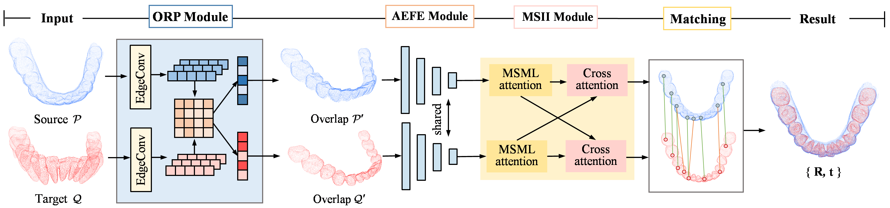

# ORE-Net

This repo is the official project repository of the paper **_ORE-Net: Overlapping-aware and Rotation-Equivariant Network for CBCT-IOS Point Cloud Registration_**. 

## The Overall Framework 
 

## Installation

Please use the following command for installation.

```bash
# It is recommended to create a new environment
conda create -n orenet python==3.8
conda activate orenet

pip install torch==1.13.0+cu116 torchvision==0.14.0+cu117 torchaudio==0.13.0 --extra-index-url https://download.pytorch.org/whl/cu117

# Install packages and other dependencies
pip install -r requirements.txt
python setup.py build develop

cd areconv/extentions/pointops/
python setup.py install
```
### Dataset:

If needed, please contact: [Lin Zhang](mailto:lin.zhang@cumt.edu.cn).

## Demo
After installation, you can run the demo script in `experiments/Tooth` by:
```bash
cd experiments/Tooth
python demo.py
```
Note: Pre-trained weights are required to run the demo.
Please contact the author to obtain the pre-trained weights.

## Training
You can train a model by the following commands:

```bash
cd experiments/Tooth
CUDA_VISIBLE_DEVICES=0 python trainval.py
```
You can also use multiple GPUs by:
```bash
CUDA_VISIBLE_DEVICES=GPUS python -m torch.distributed.launch --nproc_per_node=NGPUS trainval.py
```
For example,
```bash
CUDA_VISIBLE_DEVICES=0,1 python -m torch.distributed.launch --nproc_per_node=2 trainval.py
```

## Testing
To test a pre-trained models on Tooth, use the following commands:
```bash
# Tooth
python test.py --benchmark Tooth --snapshot path/to/your_weights.pth.tar
```

## Acknowledgements
Our code is heavily brought from
- [PARENet](https://github.com/yaorz97/PARENet)
- [GeoTransformer](https://github.com/qinzheng93/GeoTransformer)
- [VectorNeurons](https://github.com/FlyingGiraffe/vnn)
